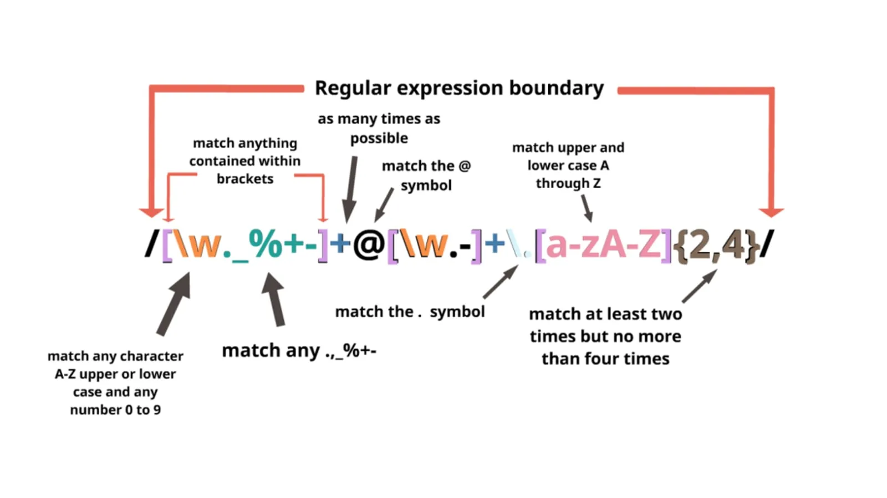

# ReAnalogy Dataset

`pip install reanalogy`

ReAnalogy is a dataset curated from regular expressions used in open-source python projects at GitHub and combined with three previous dataset available [KB13](http://people.csail.mit.edu/nkushman/papers/naacl2013.pdf), [NL-RX-Turk](https://arxiv.org/abs/1608.03000), [Lingua Franca](https://arxiv.org/abs/2105.04397)

We use ReAnalogy to test the inductive reasoning ability of Large Language Models.


## What are regular expressions?


Regular expressions are a formal language where we evaluate a sequence of characters by a program. Similarly, the same program can be used to generate text.

## Why ReAnalogy?

ReAnalogy has more complex expressions than the previously mentioned datasets.  The regular expressions in ReAnalogy contain natural language such as:
 * ReAnalogy regex `applying.*?jquery.*?script` will generate `applying+WjqueryaK-6py|w9$script`
 * whereas, KB13 regex `(.*[0-9].*){5,}` will generate `Er9?=0mQL92:?$)\\BzG 1`

The quasi-natural language in ReAnalogy make it a benchmark that is:

1. Closer to natural language
2. Challenging
3. Contain a ground-truth

Additionally, it is an unbiased benchmark to evaluate reasoning of a Language Model as there is a ground-truth to evaluate whether the Language Model can succesfully reason. For example, we can evaluate whether a generated `Fact` (text) can be matched by a `Rule` (regex).

## Usage

```python
from reanalogy.dataset import ReAnalogy
from torch.utils.data import DataLoader
ds = ReAnalogy(
        data_path,
        split="train",
        return_regex=True,
        dataset_name="reanalogy",
        n_examples=5,
    )
dl = DataLoader(ds, batch_size=128, num_workers=0)
```

The examples are generated on the fly. We recommend setting `num_workers>0` for multi-processing and avoiding a bottleneck by the generation process of the examples.

Additional supported datasets are:
`dataset_name = "deep"` and `dataset_name = "kb13"`.

